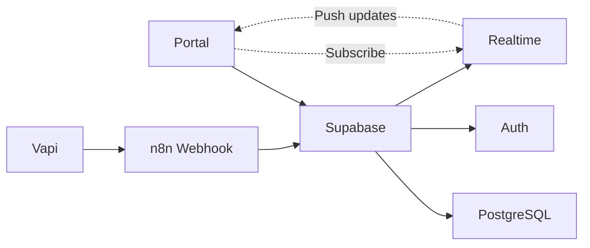

# Portal Requirement Analysis
## Voice AI Receptionist Management Portal

---

## Executive Summary

**VERDICT: A Management Portal IS Required**

The Voice AI Receptionist system, while technically functional without a portal, requires a web-based management interface for practical, day-to-day operation by restaurant staff. Without a portal, restaurant operators would need direct database access or technical knowledge to manage the system—an unacceptable requirement for this target market.

---

## Stakeholder Analysis

### Primary Users

| Role | Technical Skill | Usage Frequency | Key Needs |
|------|-----------------|-----------------|-----------|
| Restaurant Owner | Low-Medium | Daily (quick checks) | ROI visibility, alert awareness |
| General Manager | Medium | Multiple times daily | Callback management, booking oversight |
| Host/Hostess | Low | Continuous during shift | Real-time booking view, availability updates |
| Chef/Kitchen Manager | Low | Weekly | Review food-related feedback |

### Without Portal - Pain Points

1. **Booking Visibility**: Staff must check CRM directly, which may not show AI-specific context
2. **Callback Follow-up**: Slack-only notifications get lost in channel noise
3. **Hours Changes**: Requires editing n8n workflows or Vapi config (impossible for non-technical staff)
4. **Performance Tracking**: No visibility into whether the AI investment is paying off
5. **Training**: No way to see what the AI is saying to customers

---

## Feature Requirements Matrix

### MUST HAVE (MVP)

| Feature | Business Justification | Complexity |
|---------|----------------------|------------|
| **Dashboard** | Owners need quick "how's it going" check | Medium |
| **Call Log** | Verify AI behavior, handle disputes | Medium |
| **Callback Queue** | Critical for converting missed opportunities | Medium |
| **Business Hours** | Frequent changes (holidays, events) | Low |
| **Settings** | Restaurant-specific configuration | Low |

### SHOULD HAVE (v1.1)

| Feature | Business Justification | Complexity |
|---------|----------------------|------------|
| **Analytics** | Prove ROI, identify improvement opportunities | Medium |
| **Knowledge Base Editor** | Update FAQs without developer help | Medium |
| **Booking Calendar** | Visual availability management | High |
| **Audio Playback** | Quality assurance, training | Low |

### COULD HAVE (v2.0)

| Feature | Business Justification | Complexity |
|---------|----------------------|------------|
| **AI Behavior Tuning** | Adjust prompts via guided interface | High |
| **Multi-location Support** | Scale to restaurant groups | High |
| **Staff Accounts** | Role-based access control | Medium |
| **API for POS Integration** | Connect to existing systems | High |

---

## MVP Feature Specifications

### 1. Dashboard Page

**Purpose**: At-a-glance system health and today's metrics

**Components**:
```
┌─────────────────────────────────────────────────────────────┐
│  🟢 System Status: Healthy          Last call: 5 min ago   │
├─────────────────────────────────────────────────────────────┤
│  ┌──────────┐  ┌──────────┐  ┌──────────┐  ┌──────────┐    │
│  │ Today's  │  │ Bookings │  │ Pending  │  │   Avg    │    │
│  │  Calls   │  │   Made   │  │ Callbacks│  │ Duration │    │
│  │    23    │  │    18    │  │  ⚠️ 3    │  │  2:34    │    │
│  │  ↑12%    │  │   78%    │  │  urgent  │  │  ↓8%     │    │
│  └──────────┘  └──────────┘  └──────────┘  └──────────┘    │
├─────────────────────────────────────────────────────────────┤
│  Recent Calls                        Today's Bookings       │
│  ┌─────────────────────────┐        ┌─────────────────┐    │
│  │ 2:34pm Booking ✓        │        │ ○ 5:00 Smith (4)│    │
│  │ 2:21pm FAQ Answered     │        │ ○ 5:30 Jones (2)│    │
│  │ 2:15pm Callback Created │        │ ● 6:00 Brown (6)│    │
│  │ 1:58pm Booking ✓        │        │ ○ 6:30 Davis (4)│    │
│  │ 1:42pm Transferred      │        │ ...             │    │
│  └─────────────────────────┘        └─────────────────┘    │
├─────────────────────────────────────────────────────────────┤
│  ⚠️ Pending Callbacks (3)                                   │
│  ┌─────────────────────────────────────────────────────┐   │
│  │ 🔴 URGENT: +1-XXX-XXX-1234 - No availability        │   │
│  │    Created 45 min ago  [Call Back] [Complete]       │   │
│  │ 🟡 NORMAL: +1-XXX-XXX-5678 - System error           │   │
│  │    Created 2 hours ago [Call Back] [Complete]       │   │
│  └─────────────────────────────────────────────────────┘   │
└─────────────────────────────────────────────────────────────┘
```

**Data Sources**:
- `calls` table: Today's count, status breakdown
- `bookings` table: Today's bookings with times
- `callbacks` table: Pending items sorted by priority

**Real-time Requirements**:
- Subscribe to new call inserts
- Subscribe to callback status changes
- Update stats every 60 seconds

---

### 2. Call Log Page

**Purpose**: Searchable history of all voice AI interactions

**Features**:
- Date range filter
- Outcome filter (dropdown)
- Search by phone (last 4 digits only for privacy)
- Sortable columns
- Click row for detail panel

**Call Detail Panel**:
```
┌─────────────────────────────────────────────────────────────┐
│  Call Details                                    [X Close]  │
├─────────────────────────────────────────────────────────────┤
│  Date: Dec 3, 2024 at 2:34 PM                              │
│  Duration: 2 minutes 34 seconds                            │
│  Caller: +1-XXX-XXX-1234                                   │
│  Outcome: ✓ Booking Made                                   │
├─────────────────────────────────────────────────────────────┤
│  [▶ Play Recording]                                        │
├─────────────────────────────────────────────────────────────┤
│  Transcript:                                               │
│  ────────────────────────────────────────────              │
│  AI: Thank you for calling The Golden Fork...              │
│  Customer: Hi, I'd like to make a reservation...           │
│  AI: I'd be happy to help. For how many guests?            │
│  Customer: Four people, this Friday at 7.                  │
│  AI: Let me check availability for Friday at 7 PM...       │
│  ...                                                       │
├─────────────────────────────────────────────────────────────┤
│  Linked Booking: #ABC123 - View Booking →                  │
├─────────────────────────────────────────────────────────────┤
│  Notes:                                                    │
│  ┌─────────────────────────────────────────────────────┐   │
│  │ Add internal notes about this call...               │   │
│  └─────────────────────────────────────────────────────┘   │
│                                              [Save Notes]   │
└─────────────────────────────────────────────────────────────┘
```

**Privacy Considerations**:
- Phone numbers always masked in display
- Full number only visible on click with confirmation
- Recording playback logged for audit

---

### 3. Callback Queue Page

**Purpose**: Manage follow-ups for calls that couldn't be completed

**Layout**:
```
┌─────────────────────────────────────────────────────────────┐
│  Callbacks                                                  │
│  ┌────────────────────────────────────────────────────┐    │
│  │ [All (5)] [Urgent (2)] [Normal (3)] [Completed ✓]  │    │
│  └────────────────────────────────────────────────────┘    │
├─────────────────────────────────────────────────────────────┤
│  ┌─────────────────────────────────────────────────────┐   │
│  │ 🔴 URGENT                              45 min ago   │   │
│  │ +1-XXX-XXX-1234                                     │   │
│  │ Reason: No availability for requested time          │   │
│  │ Customer wanted: Fri 7pm, party of 4               │   │
│  │ ─────────────────────────────────────────────────  │   │
│  │ [📞 Call Back]  [📝 Create Booking]  [✓ Complete]  │   │
│  └─────────────────────────────────────────────────────┘   │
│                                                            │
│  ┌─────────────────────────────────────────────────────┐   │
│  │ 🔴 URGENT                              1 hour ago   │   │
│  │ +1-XXX-XXX-5678  (Customer: Jane D.)               │   │
│  │ Reason: Safety transfer - mentioned nut allergy     │   │
│  │ ─────────────────────────────────────────────────  │   │
│  │ [📞 Call Back]  [📝 Add Notes]  [✓ Complete]       │   │
│  └─────────────────────────────────────────────────────┘   │
└─────────────────────────────────────────────────────────────┘
```

**Workflow**:
1. Staff sees callback notification
2. Clicks "Call Back" → opens phone dialer
3. After call, clicks "Complete"
4. Resolution modal appears:
   - Resolution type: Booked / No Answer / Declined / Other
   - Notes field
   - If "Booked" → link to new booking

---

### 4. Settings Page

**Purpose**: Configure restaurant-specific settings

**Sections**:

**A. Business Information**
- Restaurant name
- Phone number
- Address
- Timezone (dropdown)

**B. Business Hours**
```
┌─────────────────────────────────────────────────────────────┐
│  Business Hours                                            │
│  ────────────────────────────────────────────              │
│  Monday    [Closed ✓]                                      │
│  Tuesday   [Open] [17:00 ▼] to [22:00 ▼]                   │
│  Wednesday [Open] [17:00 ▼] to [22:00 ▼]                   │
│  Thursday  [Open] [17:00 ▼] to [22:00 ▼]                   │
│  Friday    [Open] [17:00 ▼] to [23:00 ▼]                   │
│  Saturday  [Open] [17:00 ▼] to [23:00 ▼]                   │
│  Sunday    [Open] [16:00 ▼] to [21:00 ▼]                   │
│                                                            │
│  Last seating: [60 ▼] minutes before close                 │
└─────────────────────────────────────────────────────────────┘
```

**C. Booking Settings**
- Max party size for AI (default: 8)
- Large party threshold (triggers transfer)
- SMS confirmation template (with variables preview)
- Cancellation policy text

**D. Notifications**
- Slack webhook URL
- Alert preferences (what to notify about)
- Daily digest email

---

## Technical Architecture

### Recommended Stack

| Layer | Technology | Rationale |
|-------|------------|-----------|
| **Frontend** | React + TypeScript + Vite | Fast, type-safe, modern tooling |
| **Styling** | Tailwind CSS | Rapid development, consistent design |
| **Icons** | Lucide React | Clean, professional icon set |
| **Charts** | Recharts | React-native, good for dashboards |
| **State** | TanStack Query | Server state management, caching |
| **Routing** | React Router v6 | Standard, well-documented |
| **Backend** | Supabase | Already in stack, auth + realtime |
| **Hosting** | Vercel | Free tier, instant deploys |

### Why Not Alternatives?

| Alternative | Why Not |
|-------------|---------|
| Next.js | Overkill for dashboard app, adds complexity |
| Vue/Svelte | Team familiarity with React (LuxeSalon stack) |
| Firebase | Already invested in Supabase |
| Self-hosted | Vercel free tier sufficient, simpler ops |

### Data Flow



---

## MVP Development Estimate

| Phase | Components | Est. Hours |
|-------|------------|------------|
| **Setup** | Scaffold, routing, auth | 4 |
| **Dashboard** | Stats, recent lists, callbacks | 8 |
| **Call Log** | List, filters, detail panel | 6 |
| **Callbacks** | Queue, actions, resolution | 6 |
| **Settings** | Forms, validation, persistence | 6 |
| **Polish** | Loading states, errors, responsive | 4 |
| **Testing** | Manual QA, bug fixes | 4 |
| **Deploy** | Vercel setup, env config | 2 |

**Total: ~40 hours (1 week full-time)**

---

## Conclusion

The management portal is **essential** for the Voice AI Receptionist system to be practically deployable in restaurant environments. Without it, the system would require technical expertise to operate, monitor, and adjust—expertise that restaurant staff typically do not have.

The MVP scope defined above provides:
1. **Operational visibility** (Dashboard, Call Log)
2. **Recovery mechanisms** (Callback Queue)
3. **Self-service configuration** (Settings)

This enables restaurant operators to manage the AI system independently after initial setup, which is critical for the service to be scalable and sustainable.
