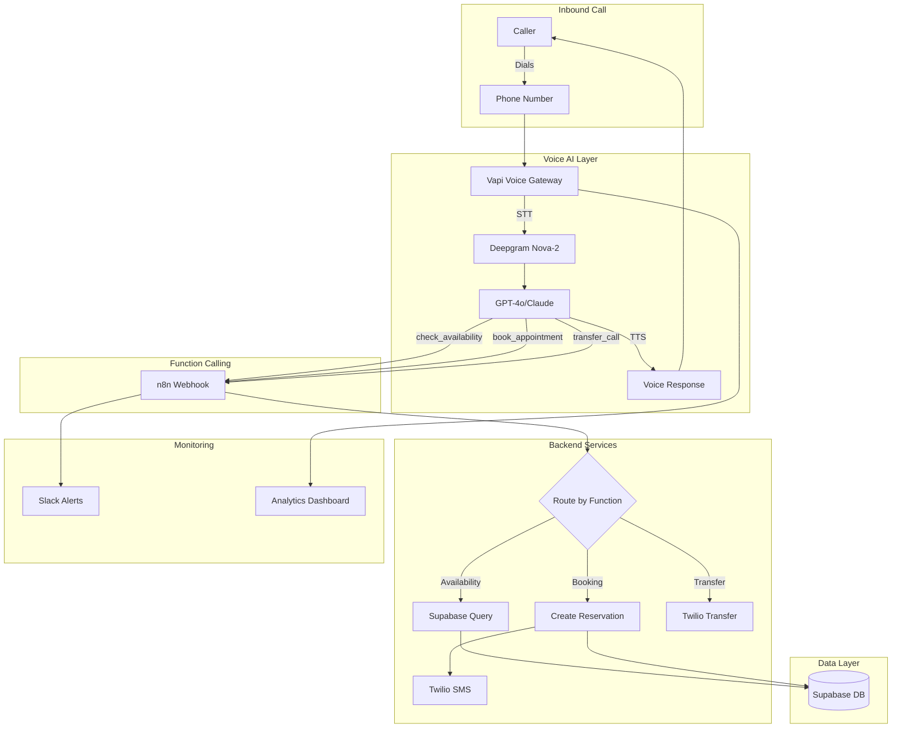

# Voice AI Receptionist

A 24/7 AI Voice Agent that answers restaurant calls instantly, handles FAQs, and integrates directly with the reservation calendar. Part of the Restaurant AI Automation suite.

> **Reference**: Based on Section 2 of the Restaurant AI Automation Master Guide v2.0 - "The Never-Miss-A-Table Voice AI Receptionist"

## Overview

Restaurants lose an estimated $136 billion annually due to missed calls. During peak hours (6-8 PM), staff prioritize in-person guests, leaving phones unanswered. This Voice AI Receptionist solves that problem by:

- Answering calls 24/7 with sub-500ms latency
- Handling reservation bookings with real-time availability checks
- Responding to FAQs (hours, parking, dietary accommodations)
- Safely transferring to humans for edge cases (allergies, large parties)
- Sending SMS confirmations with TCPA compliance

**Estimated ROI**: $900+/month per location (10 captured reservations @ $50 avg ticket + labor savings)

## Prerequisites

- **Node.js** v18+ (for portal and testing)
- **n8n** self-hosted instance (orchestration layer)
- **Vapi.ai** account (voice AI platform)
- **Supabase** project (database and auth)
- **Twilio** account (SMS confirmations)
- **OpenAI API** key (fallback LLM for n8n)
- **Slack** workspace (alerts and approvals)

## Quick Start

### 1. Clone and Configure

```bash
git clone <repository-url>
cd voice-ai-receptionist
cp .env.example .env
# Edit .env with your credentials
```

### 2. Set Up Database

```bash
# Run in Supabase SQL Editor
psql -f database/schema.sql
psql -f database/seed.sql
```

### 3. Import n8n Workflows

1. Open your n8n instance
2. Import `n8n/workflows/voice-ai-webhook.json`
3. Import `n8n/workflows/booking-confirmation.json`
4. Import `n8n/workflows/callback-handler.json`
5. Configure credentials per `n8n/credentials.md`

### 4. Configure Vapi Assistant

1. Create new assistant in Vapi dashboard
2. Import configuration from `vapi/assistant-config.json`
3. Add tools from `vapi/tools/`
4. Set system prompt from `vapi/prompts/system-prompt.md`
5. Upload knowledge base from `vapi/knowledge-base/`

### 5. Connect Phone Number

1. Purchase or port number in Vapi
2. Assign to Voice AI assistant
3. Configure Twilio webhook for SMS delivery status

### 6. Test

```bash
# Run integration tests
npm run test:integration

# Run load tests (50 concurrent calls)
npm run test:load
```

## Architecture Overview



### State Machine

The conversation follows a strict state machine to prevent circular conversations:

| State | Behavior | Exit Conditions |
|-------|----------|-----------------|
| GREETING | Welcome caller, identify intent | Intent identified |
| QUALIFICATION | Collect: party size, date, time, name, phone | All fields collected |
| AVAILABILITY_CHECK | Query calendar, present options | Slot selected or negotiation |
| NEGOTIATION | Offer alternatives (max 3 attempts) | Alternative accepted or handoff |
| CONFIRMATION | Book appointment, send SMS | Booking complete |
| HANDOFF | Transfer to human or take callback | Transfer complete |

## Project Structure

```
voice-ai-receptionist/
├── README.md                    # This file
├── .env.example                 # Environment variable template
├── .gitignore                   # Git ignore rules
├── docs/
│   ├── ARCHITECTURE.md          # Detailed system architecture
│   ├── API_REFERENCE.md         # Webhook endpoints documentation
│   └── RUNBOOK.md               # Operational procedures
├── database/
│   ├── schema.sql               # Supabase SQL schema
│   ├── seed.sql                 # Test restaurant data
│   └── migrations/              # Schema version changes
├── n8n/
│   ├── workflows/
│   │   ├── voice-ai-webhook.json        # Main webhook handler
│   │   ├── booking-confirmation.json    # SMS confirmation flow
│   │   └── callback-handler.json        # Failed booking recovery
│   └── credentials.md           # Required n8n credentials
├── vapi/
│   ├── assistant-config.json    # Vapi assistant configuration
│   ├── tools/
│   │   ├── check-availability.json
│   │   ├── book-appointment.json
│   │   └── transfer-call.json
│   ├── prompts/
│   │   └── system-prompt.md     # Production system prompt
│   └── knowledge-base/
│       └── restaurant-policies.json
├── portal/                      # React management portal
│   ├── package.json
│   └── src/
└── tests/
    ├── integration/             # End-to-end test scenarios
    └── load/                    # Concurrent call testing
```

## Environment Variables

See `.env.example` for all required configuration. Key variables:

| Variable | Description |
|----------|-------------|
| `SUPABASE_URL` | Supabase project URL |
| `SUPABASE_SERVICE_KEY` | Service role key for backend operations |
| `VAPI_API_KEY` | Vapi API authentication |
| `N8N_WEBHOOK_SECRET` | Webhook authentication header value |
| `TWILIO_*` | SMS sending credentials |
| `SLACK_WEBHOOK_URL` | Alert notifications |

## Key Metrics

| Metric | Target | Alert Threshold |
|--------|--------|-----------------|
| Call Completion Rate | > 85% | < 70% |
| Tool Call Latency (p95) | < 2s | > 4s |
| Booking Success Rate | > 90% | < 80% |
| SMS Delivery Rate | > 98% | < 95% |

## Safety Features

- **Allergy Detection**: Immediate transfer to manager if allergy keywords detected
- **Large Party Handling**: Parties > 8 routed to events coordinator
- **TCPA Compliance**: Explicit verbal consent required before SMS
- **No Liability Admission**: AI never confirms food is "safe" for allergies
- **Graceful Degradation**: Callback system if CRM unavailable

## License

Proprietary - See LICENSE file for details.

## Support

For implementation support, refer to the Restaurant AI Automation Master Guide v2.0.
