# System Architecture

> **Reference**: Based on Section 2 of the Restaurant AI Automation Master Guide v2.0 - "The Never-Miss-A-Table Voice AI Receptionist"

## Overview

The Voice AI Receptionist is a synchronous voice-to-data pipeline with real-time function calling. It operates as an always-on virtual host that answers calls, handles reservations, responds to FAQs, and gracefully escalates complex situations to human staff.

**Core Technology Stack:**

| Component | Primary Choice | Rationale |
|-----------|---------------|-----------|
| Orchestration | n8n (self-hosted) | Data sovereignty, no per-operation costs |
| Voice AI | Vapi.ai | Best function calling, sub-500ms latency |
| LLM | GPT-4o | Vision capability, cost-effective |
| Database | Supabase (PostgreSQL) | Real-time subscriptions, built-in auth |
| Transcription | Deepgram Nova-2 | Fastest real-time, best for noisy environments |
| SMS | Twilio | Reliable delivery, TCPA compliance tools |

---

## 1. High-Level Architecture Diagram

```mermaid
flowchart TB
    subgraph "External Callers"
        Caller[("📞 Caller")]
    end

    subgraph "Phone Infrastructure"
        PhoneNum["Phone Number<br/>(Vapi-managed or Twilio)"]
    end

    subgraph "Voice AI Platform (Vapi)"
        direction TB
        VapiGW["Vapi Voice Gateway"]

        subgraph "Speech Pipeline"
            STT["Deepgram Nova-2<br/>Speech-to-Text"]
            LLM["GPT-4o<br/>Conversation Engine"]
            TTS["ElevenLabs/PlayHT<br/>Text-to-Speech"]
        end

        STT --> LLM
        LLM --> TTS
    end

    subgraph "Orchestration Layer (n8n)"
        direction TB
        Webhook["Webhook Handler<br/>/webhook/vapi-restaurant"]

        subgraph "Function Handlers"
            Router{{"Function<br/>Router"}}
            AvailCheck["check_availability<br/>Handler"]
            BookHandler["book_appointment<br/>Handler"]
            TransferHandler["transfer_call<br/>Handler"]
        end

        subgraph "Support Workflows"
            SMSFlow["SMS Confirmation<br/>Workflow"]
            CallbackFlow["Callback<br/>Handler"]
            ErrorFlow["Error Recovery<br/>Handler"]
        end

        Webhook --> Router
        Router --> AvailCheck
        Router --> BookHandler
        Router --> TransferHandler
        BookHandler --> SMSFlow
    end

    subgraph "Data Layer (Supabase)"
        direction TB
        SupaAPI["Supabase API<br/>(PostgREST)"]
        SupaDB[("PostgreSQL<br/>Database")]
        SupaRT["Real-time<br/>Subscriptions"]

        SupaAPI --> SupaDB
        SupaRT --> SupaDB
    end

    subgraph "Management Portal (React/Next.js)"
        direction TB
        Dashboard["Dashboard<br/>KPIs & Analytics"]
        ResMgmt["Reservation<br/>Management"]
        CallbackQueue["Callback<br/>Queue"]
        Settings["Settings &<br/>Configuration"]
    end

    subgraph "External Services"
        Twilio["Twilio<br/>SMS Gateway"]
        Slack["Slack<br/>Alerts & Approvals"]
    end

    %% Call Flow
    Caller <--> PhoneNum
    PhoneNum <--> VapiGW
    VapiGW --> STT
    TTS --> VapiGW

    %% Function Calling
    LLM -->|"Function Call<br/>(JSON)"| Webhook
    Webhook -->|"Response<br/>(JSON)"| LLM

    %% Data Operations
    AvailCheck <--> SupaAPI
    BookHandler <--> SupaAPI
    CallbackFlow --> SupaAPI

    %% Notifications
    SMSFlow --> Twilio
    Twilio -->|"SMS"| Caller
    TransferHandler --> Slack
    CallbackFlow --> Slack
    ErrorFlow --> Slack

    %% Portal Connections
    Dashboard <--> SupaAPI
    ResMgmt <--> SupaAPI
    CallbackQueue <--> SupaAPI
    Settings <--> SupaAPI

    %% Real-time Updates
    SupaRT -.->|"Real-time<br/>Updates"| Dashboard
    SupaRT -.->|"Real-time<br/>Updates"| CallbackQueue

    %% Styling
    classDef external fill:#e1f5fe,stroke:#01579b
    classDef vapi fill:#fff3e0,stroke:#e65100
    classDef n8n fill:#f3e5f5,stroke:#7b1fa2
    classDef supabase fill:#e8f5e9,stroke:#2e7d32
    classDef portal fill:#fce4ec,stroke:#c2185b
    classDef services fill:#fff8e1,stroke:#f57f17

    class Caller,PhoneNum external
    class VapiGW,STT,LLM,TTS vapi
    class Webhook,Router,AvailCheck,BookHandler,TransferHandler,SMSFlow,CallbackFlow,ErrorFlow n8n
    class SupaAPI,SupaDB,SupaRT supabase
    class Dashboard,ResMgmt,CallbackQueue,Settings portal
    class Twilio,Slack services
```



---

## 2. Component Responsibilities

### 2.1 Vapi (Voice AI Platform)

**Primary Responsibilities:**
- Inbound call handling and routing
- Real-time speech-to-text conversion (Deepgram Nova-2)
- LLM conversation management and context handling
- Text-to-speech response generation
- Function calling to external webhooks
- Call recording and transcription storage

**Key Configuration:**

| Setting | Value | Rationale |
|---------|-------|-----------|
| STT Provider | Deepgram Nova-2 | Best accuracy in noisy restaurant environments |
| LLM Model | GPT-4o | Fast, cost-effective, excellent function calling |
| TTS Provider | ElevenLabs | Natural-sounding voice |
| Max Call Duration | 10 minutes | Prevent runaway calls |
| Silence Timeout | 30 seconds | Allow thinking time |

**Latency Targets:**
- Speech-to-text: < 200ms
- LLM response: < 300ms
- End-to-end (speak → hear response): < 500ms

### 2.2 n8n (Orchestration Layer)

**Primary Responsibilities:**
- Webhook endpoint management for Vapi function calls
- Business logic execution and validation
- Database operations (CRUD via Supabase API)
- SMS confirmation triggering
- Error handling and fallback flows
- Slack alerting and notifications

**Workflow Architecture:**

```
┌─────────────────────────────────────────────────────────────────┐
│                     MAIN WEBHOOK HANDLER                         │
│                  /webhook/vapi-restaurant                        │
├─────────────────────────────────────────────────────────────────┤
│  ┌──────────────┐  ┌──────────────┐  ┌──────────────┐          │
│  │    Route:    │  │    Route:    │  │    Route:    │          │
│  │check_avail   │  │book_appoint  │  │transfer_call │          │
│  └──────┬───────┘  └──────┬───────┘  └──────┬───────┘          │
│         │                 │                 │                    │
│         ▼                 ▼                 ▼                    │
│  ┌──────────────┐  ┌──────────────┐  ┌──────────────┐          │
│  │   Validate   │  │   Validate   │  │  Log Safety  │          │
│  │  Parameters  │  │  Parameters  │  │   Trigger    │          │
│  └──────┬───────┘  └──────┬───────┘  └──────┬───────┘          │
│         │                 │                 │                    │
│         ▼                 ▼                 ▼                    │
│  ┌──────────────┐  ┌──────────────┐  ┌──────────────┐          │
│  │Query Supabase│  │Create Record │  │ Slack Alert  │          │
│  │  Avail Slots │  │  in Supabase │  │              │          │
│  └──────┬───────┘  └──────┬───────┘  └──────┬───────┘          │
│         │                 │                 │                    │
│         ▼                 ▼                 ▼                    │
│  ┌──────────────┐  ┌──────────────┐  ┌──────────────┐          │
│  │Format Response│  │ Trigger SMS │  │Format Response│          │
│  │  for Vapi    │  │   Workflow   │  │  for Vapi    │          │
│  └──────────────┘  └──────────────┘  └──────────────┘          │
└─────────────────────────────────────────────────────────────────┘
```

**Response Time Requirements:**

| Endpoint | Target | Hard Limit | On Timeout |
|----------|--------|------------|------------|
| `/webhook/vapi-restaurant` | < 2s | 5s | Error response |
| `/webhook/booking-confirm` | < 1s | 3s | Retry queue |
| `/webhook/callback-handler` | < 5s | 10s | Slack alert |

### 2.3 Supabase (Data Layer)

**Primary Responsibilities:**
- PostgreSQL database for all persistent data
- Real-time subscriptions for portal updates
- Row Level Security (RLS) for data isolation
- API layer (PostgREST) for n8n and Portal access
- Authentication for portal users

**Database Schema Overview:**

```
┌─────────────────┐     ┌─────────────────┐     ┌─────────────────┐
│   restaurants   │     │  availability   │     │  reservations   │
├─────────────────┤     │     _slots      │     ├─────────────────┤
│ id              │◄────┤─────────────────│◄────│ id              │
│ name            │     │ id              │     │ restaurant_id   │
│ phone           │     │ restaurant_id   │     │ customer_id     │
│ operating_hours │     │ slot_datetime   │     │ slot_id         │
│ vapi_assistant  │     │ seating_type    │     │ confirmation    │
│ ...             │     │ capacity        │     │ datetime        │
└─────────────────┘     │ booked_capacity │     │ party_size      │
         │              │ is_blocked      │     │ status          │
         │              └─────────────────┘     │ source          │
         │                                      └─────────────────┘
         │
         │              ┌─────────────────┐     ┌─────────────────┐
         │              │    customers    │     │    callbacks    │
         │              ├─────────────────┤     ├─────────────────┤
         └──────────────│ id              │     │ id              │
                        │ restaurant_id   │     │ restaurant_id   │
                        │ phone           │     │ customer_phone  │
                        │ name            │     │ requested_time  │
                        │ sms_consent     │     │ failure_reason  │
                        │ sms_consent_ts  │     │ status          │
                        └─────────────────┘     └─────────────────┘
```

### 2.4 Management Portal (React/Next.js)

**Primary Responsibilities:**
- Real-time dashboard with KPIs
- Reservation management (view, modify, cancel)
- Callback queue management
- Call log review and transcript access
- System configuration and settings
- Analytics and reporting

**Key Features:**

| Feature | Description | Data Source |
|---------|-------------|-------------|
| Live Dashboard | Call volume, success rate, avg handle time | Supabase real-time |
| Today's Reservations | Calendar view of bookings | reservations table |
| Callback Queue | Pending callbacks needing follow-up | callbacks table |
| Call History | Searchable call logs with transcripts | call_logs table |
| Availability Manager | Block times, set capacity | availability_slots |
| Settings | Restaurant info, hours, policies | restaurants table |

---

## 3. Data Flow Diagrams

### 3.1 Inbound Call Flow (Complete Journey)


### 3.2 Booking Creation Flow (Detailed)

```mermaid
sequenceDiagram
    autonumber
    participant LLM as GPT-4o (Vapi)
    participant WH as n8n Webhook
    participant Val as Validation Node
    participant DB as Supabase
    participant SMS as SMS Workflow
    participant Twilio
    participant Caller

    LLM->>WH: book_appointment request
    Note right of LLM: {customer_name, phone,<br/>datetime, party_size,<br/>seating_type, sms_consent}

    WH->>Val: Parse & validate parameters

    alt Invalid phone format
        Val-->>WH: Validation error
        WH-->>LLM: {status: "error", message: "Invalid phone"}
    else Party size > 20
        Val-->>WH: Validation error
        WH-->>LLM: {status: "error", message: "Party too large"}
    end

    Val->>DB: Check slot still available

    alt Slot taken (race condition)
        DB-->>Val: Conflict
        Val-->>WH: Booking conflict
        WH-->>LLM: {status: "conflict", message: "Slot just taken"}
        Note right of LLM: AI offers alternatives
    end

    Val->>DB: BEGIN TRANSACTION
    Val->>DB: INSERT reservation
    Val->>DB: UPDATE availability_slots (increment booked)
    Val->>DB: UPSERT customer (with consent)
    DB-->>Val: Transaction complete

    alt SMS consent = true
        Val->>SMS: Trigger confirmation
        SMS->>Twilio: Send SMS
        Twilio->>Caller: 📱 "Confirmed: Table for 4..."
        Twilio-->>SMS: Delivery status
        SMS->>DB: UPDATE sms_confirmation_sent = true
    end

    Val-->>WH: Booking complete
    WH-->>LLM: {status: "booked", confirmation: "ABC123"}
```



### 3.3 Error/Fallback Flow


### 3.4 SMS Confirmation Flow


---

## 4. State Machine Diagram

The conversation flow is managed as a deterministic finite state machine to prevent circular conversations and ensure consistent user experience.

### 4.1 Complete State Diagram


### 4.2 State Definitions

| State | Purpose | Entry Condition | Exit Condition | Data Collected |
|-------|---------|-----------------|----------------|----------------|
| **GREETING** | Welcome caller, identify intent | Call connected | Intent classified | `intent_type` |
| **QUALIFICATION** | Collect booking details | Intent = booking | All 5 fields OR safety trigger | `party_size`, `date`, `time`, `name`, `phone` |
| **AVAILABILITY_CHECK** | Query calendar for slots | All fields collected | Slot status determined | `selected_slot`, `available_slots[]` |
| **NEGOTIATION** | Handle unavailable times | Requested slot unavailable | Alternative accepted OR 3 failures | `attempt_count`, `chosen_alternative` |
| **CONFIRMATION** | Complete booking, send SMS | Slot selected | Booking created | `confirmation_code`, `sms_sent` |
| **FAQ_RESPONSE** | Answer informational questions | Intent = FAQ | Answer delivered | `topic`, `follow_up_intent` |
| **HANDOFF** | Transfer to human | Safety trigger OR max failures | Transfer complete OR callback taken | `transfer_reason`, `queue`, `callback_phone` |
| **END_CALL** | Graceful termination | Booking complete OR transfer done | Call disconnected | `call_duration`, `outcome` |

### 4.3 Trigger Conditions for HANDOFF

| Trigger | Detection Method | Queue | Priority |
|---------|------------------|-------|----------|
| Allergy mention | Keywords: "allergy", "anaphylactic", "epipen" | `manager` | CRITICAL |
| Large party | `party_size > 8` | `events` | HIGH |
| Customer request | "speak to someone", "manager" | `general` | NORMAL |
| Legal keywords | "lawyer", "sick", "poisoning", "racist" | `manager` | CRITICAL |
| System failure | 3 consecutive errors | `callback` | HIGH |
| Max negotiation | 3 failed alternatives | `callback` | NORMAL |

---

## 5. Security Architecture

### 5.1 Authentication & Authorization


### 5.2 API Key Management

| Key Type | Storage | Access Level | Rotation Policy |
|----------|---------|--------------|-----------------|
| `VAPI_API_KEY` | Environment variable | Vapi API access | 90 days |
| `N8N_WEBHOOK_SECRET` | Environment variable | Webhook validation | 90 days |
| `SUPABASE_SERVICE_KEY` | Environment variable | Full database access (n8n only) | On compromise |
| `SUPABASE_ANON_KEY` | Environment variable | Public API (with RLS) | Rarely |
| `TWILIO_AUTH_TOKEN` | Environment variable | SMS sending | 90 days |
| `OPENAI_API_KEY` | Environment variable | LLM fallback | 90 days |
| `SLACK_WEBHOOK_URL` | Environment variable | Alert posting | On compromise |

**Security Best Practices:**

```
✅ DO:
- Store all keys in environment variables
- Use different keys for dev/staging/production
- Rotate keys every 90 days
- Monitor key usage for anomalies
- Use least-privilege access

❌ DON'T:
- Commit keys to version control
- Log keys in application logs
- Share keys via Slack/email
- Use production keys in development
- Give service keys to client-side code
```

### 5.3 Webhook Security

All n8n webhooks implement header-based authentication:

```javascript
// n8n Webhook Security Configuration
{
  "authentication": "headerAuth",
  "headerAuth": {
    "name": "X-Vapi-Secret",
    "value": "{{$credentials.webhookSecret}}"
  }
}
```

**Request Validation Chain:**

1. **TLS Verification**: All webhooks require HTTPS (TLS 1.2+)
2. **Header Authentication**: Validate `X-Vapi-Secret` matches
3. **Schema Validation**: Verify request body matches expected schema
4. **Rate Limiting**: 100 requests/minute per IP
5. **Input Sanitization**: Escape special characters, validate types

### 5.4 PII Handling

**Data Classification:**

| Data Type | Classification | Protection Required |
|-----------|---------------|---------------------|
| Phone numbers | PII - Confidential | Masked in logs, encrypted at rest |
| Customer names | PII - Confidential | Access controlled, encrypted at rest |
| Call recordings | PII - Confidential | 90-day retention, consent required |
| Reservation details | Business - Internal | Access controlled |
| Analytics data | Business - Internal | Aggregated only |

**PII Masking in Logs:**

```javascript
// Phone number masking
const maskPhone = (phone) => {
  // +15551234567 → +1***-***-4567
  return phone.replace(/(\+\d{1})(\d{3})(\d{3})(\d{4})/, '$1***-***-$4');
};

// Log sanitization
const sanitizeLog = (data) => ({
  ...data,
  customer_phone: maskPhone(data.customer_phone),
  customer_name: data.customer_name ? '[REDACTED]' : null
});
```

### 5.5 TCPA Compliance

**Requirements for SMS:**

1. **Explicit Consent**: Must be obtained verbally before sending any SMS
2. **Consent Recording**: Store timestamp and source of consent
3. **Opt-Out Mechanism**: Honor STOP/CANCEL replies
4. **Record Keeping**: Maintain consent records for 4 years

**Implementation:**

```sql
-- Consent tracking in customers table
ALTER TABLE customers ADD COLUMN sms_consent BOOLEAN DEFAULT FALSE;
ALTER TABLE customers ADD COLUMN sms_consent_timestamp TIMESTAMPTZ;
ALTER TABLE customers ADD COLUMN sms_consent_source VARCHAR(50);
-- Sources: 'voice_ai', 'web', 'in_person', 'import'
```

**Vapi Script for Consent:**

```
AI: "Should I text you a confirmation at that number?"
[Wait for affirmative: "yes", "sure", "please", etc.]
[Set sms_consent = true in book_appointment call]
```

---

## 6. Monitoring & Observability

### 6.1 Key Metrics

| Metric | Target | Alert Threshold | Measurement |
|--------|--------|-----------------|-------------|
| Call Completion Rate | > 85% | < 70% | Calls ending in booking / Total calls |
| Tool Call Latency (p95) | < 2s | > 4s | n8n webhook response time |
| Booking Success Rate | > 90% | < 80% | Successful bookings / Booking attempts |
| SMS Delivery Rate | > 98% | < 95% | Delivered / Sent |
| Error Rate | < 5% | > 10% | Errors / Total requests |

### 6.2 Monitoring Stack

```
┌─────────────────────────────────────────────────────────────┐
│                     MONITORING DASHBOARD                     │
├─────────────────────────────────────────────────────────────┤
│                                                              │
│  ┌──────────────┐  ┌──────────────┐  ┌──────────────┐       │
│  │  Vapi Dash   │  │  n8n Logs    │  │  Supabase    │       │
│  │  - Calls     │  │  - Executions│  │  - Queries   │       │
│  │  - Duration  │  │  - Errors    │  │  - Connections│      │
│  │  - Quality   │  │  - Latency   │  │  - Storage   │       │
│  └──────────────┘  └──────────────┘  └──────────────┘       │
│                                                              │
│  ┌──────────────┐  ┌──────────────┐  ┌──────────────┐       │
│  │  Twilio      │  │  Slack       │  │  Custom      │       │
│  │  - Delivery  │  │  - Alerts    │  │  - KPIs      │       │
│  │  - Errors    │  │  - Response  │  │  - Trends    │       │
│  └──────────────┘  └──────────────┘  └──────────────┘       │
│                                                              │
└─────────────────────────────────────────────────────────────┘
```

---

## 7. Scalability Considerations

### 7.1 Current Capacity (Single Location)

| Component | Capacity | Limiting Factor |
|-----------|----------|-----------------|
| Vapi | 50 concurrent calls | Plan limit |
| n8n | ~100 req/min | Single instance CPU |
| Supabase | 500 connections | Connection pool |
| Twilio | 1 SMS/second | Account limit |

### 7.2 Multi-Location Architecture

For scaling to multiple restaurant locations:


**Multi-tenant considerations:**
1. Add `restaurant_id` to all queries
2. Separate Vapi assistants per location (different prompts, hours)
3. Row Level Security based on `restaurant_id`
4. Consider separate Supabase projects for large deployments
